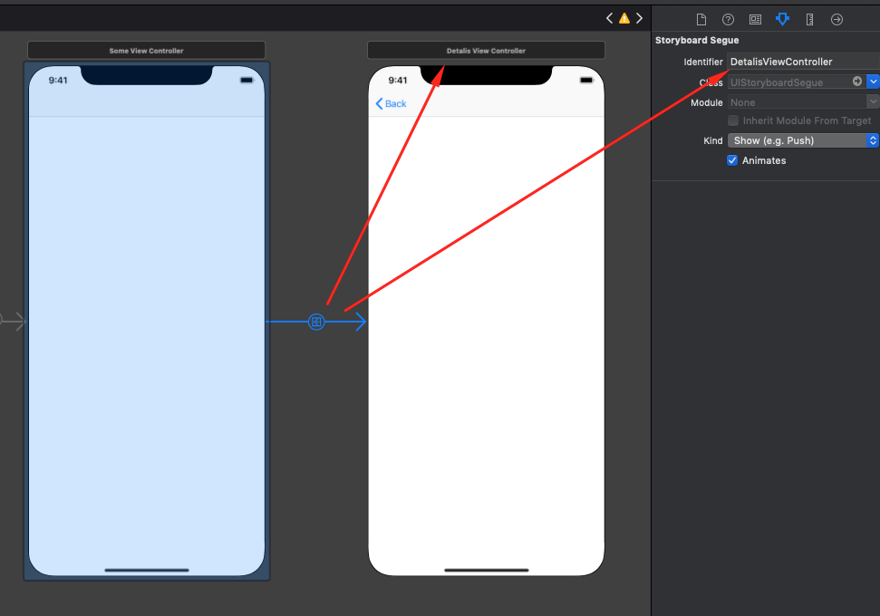

# AeroHelpers
Набор хелперов и обёрток
- [Состав](#состав)
- [Требования](#требования)
- [Установка](#установка)
- [Документация и примеры](#документация-и-примеры)

## Состав
В составе три модуля:
- [UIViewController](#uiviewcontroller)
  - [Identifiable](#identifiable): уникальный идентификатор для view controller
- [UIView](#uiview)
  - [LoadingIndicator](#loadingindicator): блокирующий user iteraction индикатор загрузки
  - [XibLoadable](#xibkoadable): обёртка, загружающая и добавляющая UIView из xib файла
  - [ReuseIdentifiable](#reuseidentifiable): уникальный для класса, переиспользуемый идентификатор
- [Int](#int)
  - [Declension](#declension): скроление слов, в зависимости от их количества
- [String](#string)
  - [Html](#html): хелперы для работы с html строкой
  - [Marked](#marked): "раскрашивание" подстроки
  - [Currency](#currency): форматирование и работа с ценами
  - [HEXColorable](#hexcolorable): конвертация строкового представления HEX цвета в UIColor
  - [RemoveCharacters](#removecharacters): обёртка для удаления символов из строки

## Требования
- iOS 10.0+
- Xcode 10.2+
- Swift 5+

## Установка
### CocoaPods
Добавьте следующую строку в ваш Podfile:
```rb
pod 'AeroHelpers'
```
Затем в консоли в папке с вашим проектом выполните команду `pod install`.
Незабудьте перед использованием добавить `import AeroHelpers` в файле, где вы собираетесь инициализировать использование библиотеку.
В `AeroHelpers` включены все модули. Однако, в случае необходимости, можно ставить только отдельные модули, например:
```rb
pod 'AeroHelpers/Int'
pod 'AeroHelpers/UIView'
```
### Вручную
Скачайте архив из ветки `master` (стабильная версия) или интересующую вас версию из [releases](https://github.com/AeroAgency/AeroHelpers/releases).
Распакуйте и перенесите необхоидимые вам модули из папки `AeroHelpers` в свой проект.

## Документация и примеры

### UIViewController
#### Identifiable

Предоставляет уникальный идентификатор для view controller.
<details>
<summary>Документация</summary>

У `UIViewController`, соответствующего протоколу Identifiable имеются два свойства:
```swift
static var reuseIdentifier: String { get }
var reuseIdentifier: String { get }
```
Каждое возвращает имя класса-наследника от `UIViewController` 

</details>

<details>
<summary>Примеры и кейсы использования</summary>


```swift
import AEROHelpers
import UIKit

class DetalisViewController: UIViewController, Identifiable { // Обьявляем что DetalisViewController соответствует протоколу Identifiable
    //...
}
...
class SomeViewController: UIViewController {
    override func prepare(for segue: UIStoryboardSegue, sender: Any?) {
        switch segue.identifier {
        case DetalisViewController.identifier: // Id перехода на DetalisViewController соответствует классу DetalisViewController
            // делаем что необходимо, внедряем в DetalisViewController, etc
        default:
            break
        }
    }
}
```

</details>

<br/>

### UIView
#### LoadingIndicator

Индикатор загрузки, появляющийся поверх любой вьюшки.
<details>
<summary>Документация</summary>

У каждой `UIView` появляется два метода:
```swift
func showLoading(fogging: Bool = true, indicatorStyle: UIActivityIndicatorView.Style? = .none)
func hideLoading()
```
Первый стартует индикатор загрузки, по всему `frame` `UIView`. Второй его убирает.

**TODO**
- Добавить настройку цвета тумана, цвета самого индикатора и его размера через `Appearance`

</details>

<details>
<summary>Примеры и кейсы использования</summary>

```swift
import AEROHelpers
import UIKit

class ViewController: UIViewController {
    @IBOutlet private var startLoadingButton: UIButton?
    
    @IBAction private func tapStartLoadingButton() {
        startLoadingButton?.showLoading()
        DispatchQueue.main.asyncAfter(deadline: .now() + 5) {
            self.startLoadingButton?.hideLoading()
        }
    }
}
```

</details>


#### XibLoadable

Загружает костомные `UIView` из xib файла.
<details>
<summary>Документация</summary>

Любая кастомная UIView, которая соответствует протоколу `XibLoadable`, имеет в своём распоряжении метод `loadXib()`.
Метод должен вызываться при инициализации в соответствующих методах:
```swift
    override init(frame: CGRect) { // при инициализации в коде
        super.init(frame: frame)
        loadXib()
    }
    
    required init?(coder aDecoder: NSCoder) { // при инициализации из другого xib/storyboard
        super.init(coder: aDecoder)
        loadXib()
    }
```

</details>

<details>
<summary>Примеры и кейсы использования</summary>

```swift
//Coming soon...
```

</details>


#### ReuseIdentifiable

Предоставляет уникальный идектификтор для `UIView`
<details>
<summary>Документация</summary>

Используется в основном у UITableViewCell и UICollectionViewCell для регистрации ячеек, имеющих вёрстку в xib файле и для получения ячеек по идентификатору в `cellForRow` методах `UITableView` и `UICollectionView`.
У любой `UIView` реализующей протокол `ReuseIdentifiable` появляется два свойства:
```swift
static var reuseIdentifier: String { get }
var reuseIdentifier: String { get }
```
Возвращающие уникальный идентификтор для каждого класса, сопадающий с именем класса.

</details>

<details>
<summary>Примеры и кейсы использования</summary>

```swift
//Coming soon...
```

</details>

<br/>

### Int
#### Declension

Скроняет слова в зависимости от кол-ва сущностей.
<details>
<summary>Документация</summary>

Все целые числа типа `Int` получили:
- структуру `DeclensionsVariants`, содержашую список вариантов;
- свойство `defaultsDeclensions`, содержащую список предустановленных `DeclensionsVariants`
- метод `declension`, выполняющий непосредственно склонение

Структура `DeclensionsVariants` с 3-мя свойствами:
1. **oneVariant** - должен содержать вариант, подходящий под условие: *остаток от деления на 10 == 1* (1 день, 21 день, 1361 день)
1. **mediumVariant** - должен содержать вариант, подходящий под условие: *остаток от деления на 10 в промежутке от 2 до 4 включительно* (2 дня, 24 дня, 1363 дня)
1. **othersVariants** - должен содержать вариант, подходящий под условие: *остаток от деления на 100 в промежутке от 5 до 20 включительно, или остаток от деления на 10* (10 дней, 111 дней, 14 дней)

Cвойство `defaultsDeclensions` возвращает структуру с набором имеющихся типов склонений. Это:
- **days** - дни,

```swift
//Coming soon...
```

</details>

<details>
<summary>Примеры и кейсы использования</summary>

```swift
//Coming soon...
```

</details>

<br/>

### String
#### Html

Coming soon...
<details>
<summary>Документация</summary>

```swift
//Coming soon...
```

</details>

<details>
<summary>Примеры и кейсы использования</summary>

```swift
//Coming soon...
```

</details>


#### Marked

Coming soon...
<details>
<summary>Документация</summary>

```swift
//Coming soon...
```

</details>

<details>
<summary>Примеры и кейсы использования</summary>

```swift
//Coming soon...
```

</details>


#### Currency

Coming soon...
<details>
<summary>Документация</summary>

```swift
//Coming soon...
```

</details>

<details>
<summary>Примеры и кейсы использования</summary>

```swift
//Coming soon...
```

</details>


#### HEXColorable

Coming soon...
<details>
<summary>Документация</summary>

```swift
//Coming soon...
```

</details>

<details>
<summary>Примеры и кейсы использования</summary>

```swift
//Coming soon...
```

</details>


#### RemoveCharacters

Coming soon...
<details>
<summary>Документация</summary>

```swift
//Coming soon...
```

</details>

<details>
<summary>Примеры и кейсы использования</summary>

```swift
//Coming soon...
```

</details>

