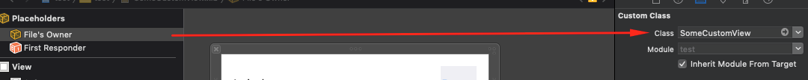
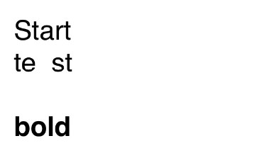
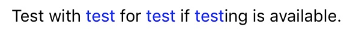
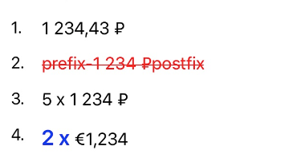

# AeroHelpers
Набор хелперов и обёрток
- [Состав](#состав)
- [Требования](#требования)
- [Установка](#установка)
- [Документация и примеры](#документация-и-примеры)

## Состав
В составе три модуля:
- [UIViewController](#uiviewcontroller)
  - [Identifiable](#identifiable): уникальный идентификатор для view controller
- [UIView](#uiview)
  - [LoadingIndicator](#loadingindicator): блокирующий user iteraction индикатор загрузки
  - [XibLoadable](#xibkoadable): обёртка, загружающая и добавляющая UIView из xib файла
  - [ReuseIdentifiable](#reuseidentifiable): уникальный для класса, переиспользуемый идентификатор
- [Int](#int)
  - [Declension](#declension): скроление слов, в зависимости от их количества
- [String](#string)
  - [Html](#html): хелперы для работы с html строкой
  - [Marked](#marked): "раскрашивание" подстроки
  - [Currency](#currency): форматирование и работа с ценами
  - [HEXColorable](#hexcolorable): конвертация строкового представления HEX цвета в UIColor
  - [RemoveCharacters](#removecharacters): обёртка для удаления символов из строки

## Требования
- iOS 10.0+
- Xcode 10.2+
- Swift 5+

## Установка
### CocoaPods
Добавьте следующую строку в ваш Podfile:
```rb
pod 'AeroHelpers'
```
Затем в консоли в папке с вашим проектом выполните команду `pod install`.
Незабудьте перед использованием добавить `import AeroHelpers` в файле, где вы собираетесь инициализировать использование библиотеку.
В `AeroHelpers` включены все модули. Однако, в случае необходимости, можно ставить только отдельные модули, например:
```rb
pod 'AeroHelpers/Int'
pod 'AeroHelpers/UIView'
```
### Вручную
Скачайте архив из ветки `master` (стабильная версия) или интересующую вас версию из [releases](https://github.com/AeroAgency/AeroHelpers/releases).
Распакуйте и перенесите необхоидимые вам модули из папки `AeroHelpers` в свой проект.

## Документация и примеры

### UIViewController
#### Identifiable

Предоставляет уникальный идентификатор для view controller.
<details>
<summary>Документация</summary>

У `UIViewController`, соответствующего протоколу Identifiable имеются два свойства:
```swift
static var reuseIdentifier: String { get }
var reuseIdentifier: String { get }
```
Каждое возвращает имя класса-наследника от `UIViewController` 

</details>

<details>
<summary>Примеры и кейсы использования</summary>


```swift
import AEROHelpers
import UIKit

class DetalisViewController: UIViewController, Identifiable { // Обьявляем что DetalisViewController соответствует протоколу Identifiable
    //...
}
...
class SomeViewController: UIViewController {
    override func prepare(for segue: UIStoryboardSegue, sender: Any?) {
        switch segue.identifier {
        case DetalisViewController.identifier: // Id перехода на DetalisViewController соответствует классу DetalisViewController
            // делаем что необходимо, внедряем в DetalisViewController, etc
        default:
            break
        }
    }
}
```

</details>

<br/>

### UIView
#### LoadingIndicator

Индикатор загрузки, появляющийся поверх любой вьюшки.
<details>
<summary>Документация</summary>

У каждой `UIView` появляется два метода и свойство:
```swift
var isLoadingProgress: Bool

func showLoading(fogging: Bool = true, indicatorStyle: UIActivityIndicatorView.Style? = .none)
func hideLoading()
```
Первый метод стартует индикатор загрузки, по всему `frame` `UIView`. Второй метод его убирает.
Свойство `isLoadingProgress` возвращает `true`, если в настоящий момент индикатор активен.

**TODO**
- Добавить настройку цвета затенения, цвета самого индикатора и его размера через `Appearance`

</details>

<details>
<summary>Примеры и кейсы использования</summary>

```swift
import AEROHelpers
import UIKit

class ViewController: UIViewController {
    @IBOutlet private var startLoadingButton: UIButton?
    
    @IBAction private func tapStartLoadingButton() {
        startLoadingButton?.showLoading()
        DispatchQueue.main.asyncAfter(deadline: .now() + 5) { // или, например, запрос к серверу
            self.startLoadingButton?.hideLoading()
        }
    }
}
```

</details>


#### XibLoadable

Загружает костомные `UIView` из xib файла.
<details>
<summary>Документация</summary>

Любая кастомная UIView, которая соответствует протоколу `XibLoadable`, уже имеет в своём распоряжении метод `loadXib()`.
Этот метод загружает view из соответсвующего имени класса xib файла. Его необходимо вызывать при ините view.

</details>

<details>
<summary>Примеры и кейсы использования</summary>

```swift
import AEROHelpers
import UIKit

class SomeCustomView: UIView, XibLoadable {

    @IBOutlet var label: UILabel?
    @IBOutlet var button: UIButton?

    
    override init(frame: CGRect) { // при инициализации в коде
        super.init(frame: frame)
        loadXib()
    }
    
    required init?(coder aDecoder: NSCoder) { // при инициализации из другого xib/storyboard
        super.init(coder: aDecoder)
        loadXib()
    }
    
    override func awakeFromNib() {
        super.awakeFromNib()
        //настраиваем view...
    }
}
```
В файле `SomeCustomView.xib` указываем file owner:

В результате такую view можно использовать и на другом xib/storyboard, так и создавать и добавлять на view программно.

</details>


#### ReuseIdentifiable

Предоставляет уникальный идектификтор для `UIView`
<details>
<summary>Документация</summary>

Используется в основном у UITableViewCell и UICollectionViewCell для регистрации ячеек, имеющих вёрстку в xib файле и для получения ячеек по идентификатору в `cellForRow` методах `UITableView` и `UICollectionView`.
У любой `UIView` реализующей протокол `ReuseIdentifiable` появляется два свойства:
```swift
static var reuseIdentifier: String { get }
var reuseIdentifier: String { get }
```
Возвращающие уникальный идентификтор для каждого класса, совпадающий с именем класса.

</details>

<details>
<summary>Примеры и кейсы использования</summary>

```swift
//Coming soon...
```

</details>

<br/>

### Int
#### Declension

Скроняет слова в зависимости от кол-ва сущностей.
<details>
<summary>Документация</summary>

Все целые числа типа `Int` получили:
- структуру `DeclensionsVariants`, содержашую список вариантов;
- свойство `defaultsDeclensions`, содержащую список предустановленных `DeclensionsVariants`
- метод `declension`, выполняющий непосредственно склонение

Структура `DeclensionsVariants` с 3-мя свойствами:
1. **oneVariant** - должен содержать вариант, подходящий под условие: *остаток от деления на 10 == 1* (1 день, 21 день, 1361 день).
1. **mediumVariant** - должен содержать вариант, подходящий под условие: *остаток от деления на 10 в промежутке от 2 до 4 включительно* (2 дня, 24 дня, 1363 дня).
1. **othersVariants** - должен содержать вариант, подходящий под условие: *остаток от деления на 100 в промежутке от 5 до 20 включительно, или остаток от деления на 10* (10 дней, 111 дней, 14 дней)

Cвойство `defaultsDeclensions` возвращает структуру с набором имеющихся типов склонений. Это:
- **days** - дни ("день", "дня", "дней")
- **seconds** - секунды ("секунду", "секунды", "секунд")
- **stones** - камни ("камень", "камня", "камней")
- **products** - изделия ("изделие", "изделия", "изделий")
- **productsGoods** - товары ("товар", "товара", "товаров")
- **items** - элементы ("элемент", "элемента", "элементов")

</details>

<details>
<summary>Примеры и кейсы использования</summary>

```swift
// Предустановленные варианты:
print("Ждём \(23) \(12.defaultsDeclensions.seconds)") // Ждём 23 секунды
print("Доставка через \(86) \(86.defaultsDeclensions.days)") // Доставка через 86 дней

// Кастомные варианты:
let variants = Int.DeclensionsVariants("год", "года", "лет")
print("Ему \(5) \(5.declension(variants))") // Ему 5 лет
print("Где-то \(23) \(23.declension(variants)) назад") // Где-то 23 года назад
print("Спустя \(13) \(10.declension(variants))") // Спустя 13 лет
```

</details>

<br/>

### String
#### Html

Coming soon...
<details>
<summary>Документация</summary>

Расширение структуры `String`, включающее в себя следующие методы:
- **html** - пытается сконвертировать строку, содержащую HTML в соответствующую ей NSAttributedString. В случае неудачи возвращает nil.
- **htmlDecoded** - пытается убрать или декодировать все HTML сущности, и перевести html-строку в обычную. В случае неудачи возвращает nil.
- **nl2br** - убирает из строки все `\r` символы и заменяет все `\n` символы на тег `<br/>`.
- **br2nl** - заменяет в строке все `<br/>` теги на символ `\n`.

</details>

<details>
<summary>Примеры и кейсы использования</summary>

**html**
```swift
let htmlString = "<font style=\"font-family: Helvetica; font-size: 24pt; \">Start <br>te&nbsp;&nbsp;st<br><br> <b>bold</b> </font>"
print("\(htmlString.html!)")
```
Результат: 
```
Start 
te  st

{
    NSColor = "kCGColorSpaceModelRGB 0 0 0 1 ";
    NSFont = "<UICTFont: 0x157e01220> font-family: \"Helvetica\"; font-weight: normal; font-style: normal; font-size: 32.00pt";
    NSKern = 0;
    NSParagraphStyle = "Alignment 4, LineSpacing 0, ParagraphSpacing 0, ParagraphSpacingBefore 0, HeadIndent 0, TailIndent 0, FirstLineHeadIndent 0, LineHeight 38/0, LineHeightMultiple 0, LineBreakMode 0, Tabs (\n), DefaultTabInterval 36, Blocks (\n), Lists (\n), BaseWritingDirection 0, HyphenationFactor 0, TighteningForTruncation NO, HeaderLevel 0";
    NSStrokeColor = "kCGColorSpaceModelRGB 0 0 0 1 ";
    NSStrokeWidth = 0;
}bold{
    NSColor = "kCGColorSpaceModelRGB 0 0 0 1 ";
    NSFont = "<UICTFont: 0x157e0c870> font-family: \"Helvetica\"; font-weight: bold; font-style: normal; font-size: 32.00pt";
    NSKern = 0;
    NSParagraphStyle = "Alignment 4, LineSpacing 0, ParagraphSpacing 0, ParagraphSpacingBefore 0, HeadIndent 0, TailIndent 0, FirstLineHeadIndent 0, LineHeight 38/0, LineHeightMultiple 0, LineBreakMode 0, Tabs (\n), DefaultTabInterval 36, Blocks (\n), Lists (\n), BaseWritingDirection 0, HyphenationFactor 0, TighteningForTruncation NO, HeaderLevel 0";
    NSStrokeColor = "kCGColorSpaceModelRGB 0 0 0 1 ";
    NSStrokeWidth = 0;
} {
    NSColor = "kCGColorSpaceModelRGB 0 0 0 1 ";
    NSFont = "<UICTFont: 0x157e01220> font-family: \"Helvetica\"; font-weight: normal; font-style: normal; font-size: 32.00pt";
    NSKern = 0;
    NSParagraphStyle = "Alignment 4, LineSpacing 0, ParagraphSpacing 0, ParagraphSpacingBefore 0, HeadIndent 0, TailIndent 0, FirstLineHeadIndent 0, LineHeight 38/0, LineHeightMultiple 0, LineBreakMode 0, Tabs (\n), DefaultTabInterval 36, Blocks (\n), Lists (\n), BaseWritingDirection 0, HyphenationFactor 0, TighteningForTruncation NO, HeaderLevel 0";
    NSStrokeColor = "kCGColorSpaceModelRGB 0 0 0 1 ";
    NSStrokeWidth = 0;
}
```


**htmlDecoded**
```swift
let htmlString = "<font style=\"font-family: Helvetica; font-size: 24pt; \">Start <br>te&nbsp;&nbsp;st<br><br> <b>bold</b> </font>"
print("\(htmlString.htmlDecoded!)")
```
Результат:
```
Start 
te  st

bold 
```

**br2nl**
```swift
let htmlString = "<font style=\"font-family: Helvetica; font-size: 24pt; \">Start <br>te&nbsp;&nbsp;st<br><br> <b>bold</b> </font>"
print("\(htmlString.nl2br)")
```
Результат:
```
<font style="font-family: Helvetica; font-size: 24pt; ">Start 
te&nbsp;&nbsp;st

 <b>bold</b> </font>
```

**nl2br**
```swift
let htmlString = "Start \nte&nbsp;&nbsp;st\n\n <b>bold</b>"
print("\(htmlString.br2nl)")
```
Результат:
```
Start <br/>te&nbsp;&nbsp;st<br/><br/> <b>bold</b>
```

</details>


#### Marked

Выделяет часть подстроки, с помощью цвета и шрифта

**TODO**
- Добавить возможность задавать цвета и шрифты через `Appearance`

<details>
<summary>Документация</summary>

Расширение структуры `String` содержит следующий метод `markSubstrings`:
```swift
    func markSubstrings(_ markedSubstrings: [String],
                        mainFont: UIFont = .systemFont(ofSize: UIFont.systemFontSize),
                        mainColor: UIColor = .darkText,
                        markFont: UIFont = .systemFont(ofSize: UIFont.systemFontSize),
                        markColor: UIColor = .blue,
                        isOnlyFirst: Bool = false) -> NSAttributedString?
```
Все параметры, кроме `markedSubstrings` опциональны.

Входные параметры:
- **markedSubstrings**: список подстрок, которые необходимо выделить;
- **mainFont**: основной шрифт, по умолчанию системный шрифт, системного размера;
- **mainColor**: цвет основного текста, по умолчанию `darkText`;
- **markFont**: шрифт выделенной подстроки, по умолчанию совпадает с шрифтом основного текста;
- **markColor**: цвет выделелнной подстроки, по умолчанию - голубой;
- **isOnlyFirst**: если в значении `true`, то тогда буду выделены все вхождения подстроки, иначе только первое найденное. По-умолчанию - `false`.

</details>

<details>
<summary>Примеры и кейсы использования</summary>

```swift
let testString = "Test with test for test if testing is available."
let markedString = testString.markSubstrings(["test"])
print("\(markedString)")
```
Результат: 

```swift
let testString = "Test with test for test if testing is available."
let font = UIFont(name: "Futura-Bold", size: 24)

let markedString = testString.markSubstrings(["test"], markFont: font!, markColor: .red, isOnlyFirst: true)
print("\(markedString)")
```
Результат: 

</details>


#### Currency

Форматирует строку (или число) как цену, в соотвествии с заданой локалью, символов валюты и другими параметрами.
<details>
<summary>Документация</summary>

Такие типы как String, Int, Float, Double расширены для соответствия протоколу `CurrencyFormatted` и реализуют этот метод 
```swift
    func currency(font: UIFont,
                  color: UIColor,
                  locale: Locale,
                  symbol: String,
                  prefix: String?,
                  postfix: String?,
                  count: Int?,
                  countFont: UIFont?,
                  countColor: UIColor?,
                  maxFraction: Int,
                  isStriked: Bool) -> NSAttributedString?
```
Обязателены только font и color параметры, остальные опциональны и имеют значения по умолчанию. В случае если не удалось распарсить строку как цену, возвращает nil.
Так же протокол `CurrencyFormatted` имеет статичный метод:
```swift
    public static func currencySymbol(for localeIdentifier: String = "ru_RU") -> String
```
возвращающий символ валюты. Используется как валюта по умолчанию.

Основной метод `currency`, преобразует запятые в точки, после чего вырезает из строки все нечисловые символы, кроме минуса (-) и точки (.). Затем форматирует строку.
Точно, в данном случае, служит разделителем целой и дробной частей. Если точек больше 1-ой, то метод вернёт nil.

Входные параметры:
- **font**: шрифт строки с ценой.
- **color**: цвет строки с ценой.
- **locale**: локаль, в соответствии с правилами которой будет форматироваться цена. По умолчанию - текущая локаль устройства.
- **symbol**: сивол валюты, который будет использован. По умолчанию - результат выполнения статичной функции `currencySymbol`, возвращающей символ для `ru_RU` локали (российский рубль).
- **prefix**: префикс, который будет стоять перед ценой. По умолчанию nil.
- **postfix**: постфикс, который будет стоять перед ценой. По умолчанию nil.
- **count**: количество товаров. По умолчанию nil. Если значение будет больше 1, то перед ценой появится это значение + ' x '. Например для значения 3 и цены 100, будет '3 x 100 ₽'
- **countFont**: шрифт количества товаров. По умолчанию nil и соответствует параметру `font`.
- **countColor**: цвет количества товаров. По умолчанию nil и соответствует параметру `color`.
- **maxFraction**: количество знаков после запятой. По умолчанию значие 0.
- **isStriked**: если `true`, то значение цены будет зачёркнуто. По умолчанию `false`.

**TODO**
- Добавить возможность задавать шрифты, цвета, символ валюты и локаль через `Appearance`

</details>

<details>
<summary>Примеры и кейсы использования</summary>

```swift
let defaultFont = UIFont.systemFont(ofSize: 18)
let defaultColor = UIColor.black

//1.
1234.4345.currency(font: defaultFont, color: defaultColor, maxFraction: 2)

//2.
" - 1 234 рублей.".currency(font: defaultFont, color: .red, prefix: "prefix", postfix: "postfix", isStriked: true)

//3.
"1 2 sd 3 ggdf4 рублей".currency(font: defaultFont, color: defaultColor, count:5)

//4.
let locale = Locale(identifier: "en_US")
let symbol = String.currencySymbol(for: "fr_FR")
"1  234  (тысяча двести тридцать четыре)".currency(font: defaultFont,
                                                    color: defaultColor,
                                                    locale: locale,
                                                    symbol: symbol,
                                                    count:2,
                                                    countFont: .boldSystemFont(ofSize: 22),
                                                    countColor: .blue)

```
Результат: 

</details>


#### HEXColorable

Проверяет, является ли строка HEX-представление цвета и преобразует в `UIColor`, если возможно.
<details>
<summary>Документация</summary>

Структура `String` была расширена протоколом `ColoredString`, имеющим два свойства:
```swift
    var isHexColor: Bool { get }
    var color: UIColor? { get }
```
- `isHexColor` проверяет, является ли строка представление HEX цвета.
- `color` пытается создать `UIColor` обьект из строки. Возвращает nil в случае неудачи.

Поддерживает полный (#FFAA99) и сокращённый (#FA9) форматы. Октоторп (символ #) является не обязательным.

</details>

<details>
<summary>Примеры и кейсы использования</summary>

```swift
        print("\("#FF8822".isHexColor)")
        print("\("#FF8822".color!)")
        print("\("FF8822".color!)")
```

Результат:
```
true
UIExtendedSRGBColorSpace 1 0.533333 0.133333 1
UIExtendedSRGBColorSpace 1 0.533333 0.133333 1
```

</details>

#### RemoveCharacters

Удаляет из строки, все символы, которые есть в переданно подстроке.

<details>
<summary>Документация</summary>

Структура `String` была расширена, и в неё добавлен метод
```swift
func removeCharacters(_ list: String, ignoreCase: Bool = false) -> String
```
Метод удаляет из искомой строки все символы, имеющиеся в переданной подстроке `list`
Если ignoreCase передан как true, то тогда символы вырезаются независимо от регистра.

</details>

<details>
<summary>Примеры и кейсы использования</summary>

```swift
        let string = "Test with test for test if testing is available."
        
        print("\(string.removeCharacters("teail"))")
        print("\(string.removeCharacters("TEAIL", ignoreCase: true))")
```

Результат:
```
Ts wh s for s f sng s vb.
s wh s for s f sng s vb.
```

</details>

